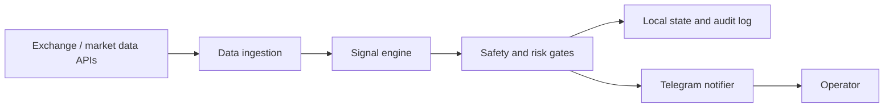

# Crypto Signal Agent MVP

Fresh MVP workspace for a crypto signal agent that can ingest market data, generate signals, apply safety gates, and send operator-facing notifications. This repository is intentionally configured to start in paper/dry-run mode.

## Stack

- Python 3.11+ application package under `crypto_agent/`
- FastAPI app served by uvicorn from `crypto_agent.main:app`
- Pydantic Settings for environment configuration
- Shell scripts for local operations under `scripts/`
- Docker and Docker Compose for repeatable worker deployment
- Optional Postgres and Redis services in Compose for persistent state and queues
- Environment-variable configuration through `.env`
- Telegram notifications via Bot API credentials
- Local durable paths under `data/` and `logs/`

The current application entry point is a FastAPI service with `/health`. Use `CRYPTO_AGENT_CMD` in `.env` only when you need to override the default uvicorn startup command.

## Architecture



Core boundaries:

- Data ingestion pulls prices, candles, websocket streams, and optional sentiment inputs.
- Signal engine evaluates technical indicators and sentiment inputs to produce structured signal candidates.
- Safety layer blocks unsafe output, enforces dry-run defaults, rate limits alerts, and records decisions.
- Notification layer sends concise signal messages to Telegram.
- Deployment layer is owned by this operational surface: Docker, Compose, Make targets, scripts, and docs.

## Safety Defaults

This project is a signal and research assistant, not financial advice and not an autonomous trading system by default.

- `CRYPTO_AGENT_MODE=paper`
- `SAFETY_DRY_RUN=true`
- `KILL_SWITCH=false`
- Telegram is disabled until credentials are supplied and `TELEGRAM_ENABLED=true`
- Risk and alert rate limits are configured in `.env`
- Secrets belong in `.env` or a secret manager, never committed source files

See [docs/safety.md](docs/safety.md) for the complete operating constraints.

## Local Setup

1. Bootstrap the workspace:

   ```sh
   make bootstrap
   ```

2. Edit `.env`:

   ```sh
   cp .env.example .env
   ```

3. Run configuration checks:

   ```sh
   make doctor
   ```

4. Start the agent locally:

   ```sh
   make run
   ```

By default, `make run` starts:

```sh
uvicorn crypto_agent.main:app --host 0.0.0.0 --port 8000
```

To run the live monitoring worker instead, set:

```sh
CRYPTO_AGENT_CMD="python3 -m crypto_agent.runner"
```

## Telegram Configuration

1. Create a bot with BotFather in Telegram and copy the bot token.
2. Start a chat with the bot.
3. Resolve the chat id using your preferred Bot API method.
4. Set these values in `.env`:

   ```sh
   TELEGRAM_ENABLED=true
   TELEGRAM_BOT_TOKEN=123456:replace_me
   TELEGRAM_CHAT_ID=123456789
   ```

Keep Telegram disabled in development unless you are intentionally testing notifications.

## Daily Reports

`crypto_agent.reports.DailyReportBuilder` renders signals, paper/backtest trades, and PnL into
Telegram-ready Markdown text. It accepts current `MarketSignal` objects and plain dictionaries, so
paper and backtest jobs can feed the same formatter.

See [docs/phase2.md](docs/phase2.md) for paper mode, backtest, persistence, and report usage,
and [docs/technical.md](docs/technical.md) for the full technical documentation: architecture,
signal engine internals, evaluation methodology, the walk-forward optimizer, and the currently
deployed strategy with its validation numbers.

## API Keys

Add only the providers the application code actually uses. Common placeholders are included in `.env.example`:

- `BINANCE_API_KEY` and `BINANCE_API_SECRET`
- `COINBASE_API_KEY` and `COINBASE_API_SECRET`
- `COINGECKO_API_KEY`

Use read-only market-data keys for the MVP. Do not enable exchange trading permissions unless the roadmap phase explicitly requires it and the safety review is complete.

## Docker

Build the image:

```sh
make docker-build
```

Run with Compose:

```sh
make up
make logs
make down
```

Compose reads `.env` automatically when present and persists local runtime files under `data/` and `logs/`.
It also starts Postgres and Redis for the default `DATABASE_URL` and `REDIS_URL`.

Useful local endpoints in API mode:

- `GET /health`
- `GET /assets`
- `POST /assets/refresh`
- `POST /candles`
- `POST /signals/{symbol}` (optional `?timeframe=15m`)
- `GET /signals`
- `GET /accuracy` — live hit rate from labeled signal outcomes
- `GET /history/outcomes` — labeled signal outcomes (take_profit / stop_loss / expired)
- `POST /streams/binance`

## Signal Accuracy Evaluation

Signal quality is measured, not assumed. Every non-suppressed BUY/SELL emitted live is
tracked against subsequent candles and labeled `take_profit`, `stop_loss`, or `expired` in the
`signal_outcomes` table (`GET /accuracy` summarizes it). The same labeling runs offline over
historical data:

```sh
make evaluate SYMBOLS="BTCUSDT ETHUSDT" TIMEFRAMES="15m" DAYS=30
```

This replays recent Binance history through the signal engine and reports hit rate,
per-side precision, winner/loser confidence, forward returns, and backtest PnL per
symbol/timeframe. Run it before and after any engine change; a change that does not move
these numbers is not an improvement.

## Operations

- Run `make doctor` before local or Docker startup.
- Use `CRYPTO_AGENT_HEALTHCHECK_URL` or `CRYPTO_AGENT_HEALTHCHECK_CMD` to make health checks meaningful once the app exposes a health surface.
- Keep `SAFETY_DRY_RUN=true` until a human reviews signal quality, alert format, and risk gates.
- Rotate keys after sharing `.env` values outside your machine.

More detail lives in [docs/operations.md](docs/operations.md).

## Roadmap

The MVP roadmap is phased from scaffold to live alerting, reporting, backtesting, and optional paper
execution. See [docs/roadmap.md](docs/roadmap.md).
