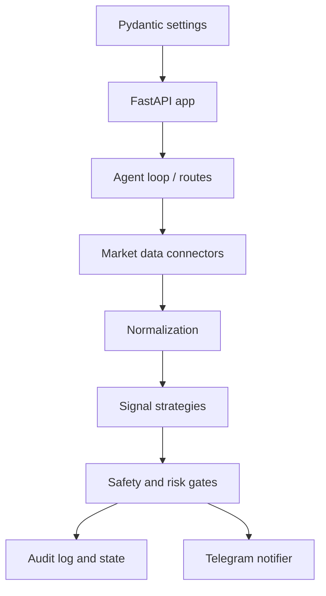

# Architecture

The MVP is structured as a FastAPI service plus signal-generation modules. The deployment layer should stay thin: it starts the process, injects configuration, preserves logs and local state, and exposes enough health information for operators.

## Runtime Components

## Boundaries

- `crypto_agent/`: Python application package owned by implementation agents.
- `tests/`: Python tests owned by implementation agents.
- `scripts/`: operational commands for bootstrap, startup, health checks, and diagnostics.
- `docs/`: architecture, safety, operations, configuration, and roadmap notes.
- `Dockerfile` and `docker-compose.yml`: repeatable local and small-host deployment.

## Configuration Flow

1. `.env` stores local configuration and secrets.
2. `crypto_agent.config.Settings` reads application settings from `.env`.
3. `docker-compose.yml` reads `.env` automatically and maps values into the container.
4. `scripts/run-local.sh` loads `.env`, executes `CRYPTO_AGENT_CMD` when set, or starts `crypto_agent.main:app` with uvicorn.

## Signal Flow

1. Poll configured symbols and timeframes.
2. Normalize raw market responses into internal candle/ticker structures.
3. Evaluate strategies and emit signal candidates.
4. Apply safety gates:
   - dry-run mode
   - confidence threshold
   - maximum signal rate
   - maximum risk limits
   - kill switch
5. Persist audit records for generated, sent, and blocked signals.
6. Notify Telegram only after safety approval.

## Deployment Model

The default deployment is a single FastAPI service backed by optional Postgres and Redis Compose services. The current app exposes `/health`, so Compose defaults `CRYPTO_AGENT_HEALTHCHECK_URL` to `http://127.0.0.1:8000/health`. For a future worker-only process, use `CRYPTO_AGENT_HEALTHCHECK_CMD` instead.
