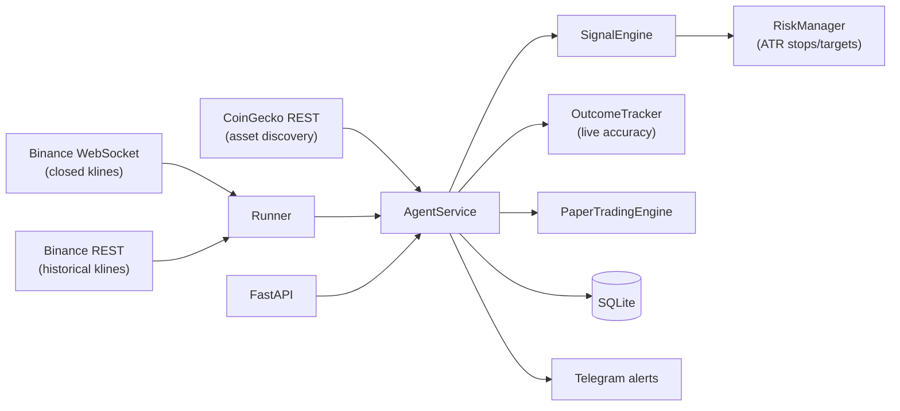

# Technical Documentation

How the crypto signal agent works end to end: architecture, algorithms, data,
evaluation methodology, and the currently deployed strategy.

## System overview



The stack is Python 3.11+, pure standard library for all analytics (no numpy /
pandas / TA-lib), FastAPI + uvicorn for the API surface, `websockets` for the
Binance stream, and SQLite (WAL mode) for persistence. Everything is
deterministic and unit-tested (58 tests).

## Data ingestion

- **Market data** — `crypto_agent/ingestion/binance.py` subscribes to Binance
  combined kline streams and yields only **closed** candles (`k.x == true`),
  so indicators never see partial bars. `ingestion/historical.py` pulls REST
  klines; `evaluation/history.py` paginates backwards to any depth.
- **Asset universe** — `ingestion/coingecko.py` fetches top assets by market
  cap; `core/stablecoins.py` filters stablecoins; `TOP_ASSET_LIMIT` caps the
  universe (currently 2: BTC, ETH).
- **Startup backfill** — the runner fetches `BACKFILL_CANDLES` (200) historical
  candles per symbol/timeframe before streaming, so indicators are warm from
  the first live candle instead of waiting ~50 bars.
- **Candle storage** — `AgentService` keeps an in-memory deque **per
  (symbol, timeframe)** (never mixed), capped at 500 candles, deduplicated on
  `open_time` (re-ingested candles replace, out-of-order ones are dropped).
  Every candle is also upserted into SQLite.
- **Sentiment** — news/social provider interfaces exist
  (`ingestion/news.py`, `ingestion/social.py`) with HTTP adapters, but no live
  feed is wired; the engine renormalizes weights so missing feeds do not
  dilute confidence (see below).

## Indicators (`crypto_agent/analysis/indicators.py`)

Pure-Python implementations, each returning a list aligned to the input with
`None` for undefined leading values:

| Indicator | Notes |
|---|---|
| SMA, EMA | EMA seeds from SMA of the first period |
| RSI(14) | Wilder smoothing |
| MACD(12,26,9) | histogram = line − signal |
| Bollinger(20, 2σ) | population variance over the window |
| ATR(14) | EMA of true range |
| ADX(14) | Wilder smoothing of ±DM/TR → DX → ADX; defined from bar 2×period |

## Signal engine (`crypto_agent/signals/engine.py`)

Each evaluation produces a `MarketSignal` from four weighted components:

| Component | Weight | Source |
|---|---|---|
| technical | 0.40 | regime-blended trend + mean-reversion score |
| volume | 0.25 | volume expansion confirming the 3-bar move |
| news | 0.20 | sentiment feed (currently absent) |
| social | 0.15 | sentiment feed (currently absent) |

**Weight renormalization.** Components without live data (`has_data=False`,
e.g. sentiment with confidence 0) are excluded from both numerator and
denominator, so confidence uses the full 0–1 range regardless of which feeds
are connected.

**Technical component.** All readings are *graded* (scaled continuously and
clamped to [-1, 1]) rather than binary:

- *Trend feature* — the average of three ATR-normalized readings:
  EMA9−EMA21 separation (full score at 0.5 ATR), close−EMA50 (full at 2 ATR),
  MACD histogram (full at 0.25 ATR). Averaging prevents triple-counting one
  underlying trend fact.
- *Mean-reversion feature* — average of RSI distance from 50 (full at ±20)
  and negated Bollinger-band position (fade the extremes).
- *Regime blend* — ADX ≥ 25 → 90% trend / 10% reversion ("trending");
  ADX ≤ 20 → 25/75 ("ranging"); linear in between ("transitional").

**Action thresholds.** `confidence = |weighted score|`. BUY/SELL at
`MINIMUM_CONFIDENCE`, WATCH at `watch_confidence` (0.45), else HOLD.

**Gates applied after scoring** (each downgrades BUY/SELL → WATCH):

1. *Regime filter* — if `REGIME_FILTER` is set, the bar's regime must match.
2. *Higher-timeframe confluence* — if a larger timeframe series is available
   (the service picks the next-larger populated one, e.g. 1d over 4h), its
   EMA9/EMA21 trend must not oppose the action.
3. *Cooldown* — repeats of the same (symbol, action) within
   `SIGNAL_COOLDOWN_SECONDS` (900 s) are flagged `suppressed` and not alerted.

**Risk plan** (`signals/risk.py`): entry = last close, stop =
`STOP_ATR_MULTIPLIER` × ATR(14) from entry, take-profits at
`TARGET_R_MULTIPLE` × stop-distance and 2× that. Risk level is labeled by
ATR/price (≥5% high, ≥2.5% medium).

## Outcome tracking (live accuracy)

Every non-suppressed BUY/SELL is registered with `OutcomeTracker`
(`evaluation/outcomes.py`). As subsequent candles of the same
symbol/timeframe arrive, each pending signal resolves to:

- `take_profit` — TP1 touched (candle high/low crossing it),
- `stop_loss` — stop touched (checked **before** target within a candle —
  conservative), or
- `expired` — neither within `max_bars` (96) bars; return marked at close.

Resolved outcomes persist to the `signal_outcomes` table.
`GET /accuracy` aggregates them into hit rate; `GET /history/outcomes` lists
them. This is the ground truth for whether live performance tracks backtests.

## Persistence (`storage/sqlite.py`)

SQLite with WAL, thread-locked, typed repositories:
`candles` (PK symbol/timeframe/open_time, upsert), `market_signals`,
`sentiment_snapshots`, `paper_trades`, `backtest_results`, `signal_outcomes`.

## Evaluation harness (`crypto_agent/evaluation/`)

`make evaluate SYMBOLS="BTCUSDT" TIMEFRAMES="4h" DAYS=180` (or
`python -m crypto_agent.evaluation`) does the following:

1. Fetches N days of closed candles (paginated REST), plus a confluence
   timeframe (`--confluence auto` = smallest timeframe ≥ 4× base).
2. Replays them through a fresh engine configured **from `.env`** (same
   thresholds, regime filter, stop/target geometry as live), maintaining a
   rolling 500-candle window and passing only already-closed higher-timeframe
   candles (no lookahead).
3. Labels every actionable signal (TP-before-SL logic identical to the live
   tracker) and reports per symbol/timeframe: hit rate (overall and per
   side), winner/loser confidence, mean forward returns at +1/+4/+12/+24
   bars, a **calibration table** (hit rate per 0.05 confidence bucket), and
   compounded backtest metrics (fees 10 bps + slippage 5 bps per side).

The backtester (`backtesting/engine.py`) replays sequential full-size
positions with fees/slippage, opposite-signal exits, and intra-candle
stop/target fills (stop checked first); the signal engine's cooldown state is
reset per run for determinism.

## Walk-forward optimizer (`evaluation/optimize.py`)

`make optimize` / `python -m crypto_agent.evaluation.optimize`. Methodology:

1. **Candidate generation** — one permissive replay (threshold ≈ 0) records
   every bar's direction, confidence, ADX regime, higher-timeframe agreement,
   and ATR.
2. **Geometry labeling** — each candidate is labeled under every
   (stop × ATR, target R) pair on the grid: stop hit first = loss, target
   = win, else expired at `max_bars`.
3. **Grid search** — configs = threshold {0.45…0.85} × regime {any, trending,
   ranging} × stop {1.0…3.0 ATR} × target {0.5…3.0 R}, with per-config
   cooldown dedup and cost subtraction (default 10 bps round trip).
4. **Walk-forward split** — configs are selected on the training window only;
   the held-out test window (e.g. last 30/90/180 days) is reported untouched.
5. **Ranking** — `--rank hit-rate`: maximize the Wilson 95% lower bound of hit
   rate subject to hit ≥ target and expectancy > 0. `--rank profit`: maximize
   the 95% lower bound of mean per-trade return.

Every report shows the **geometric baseline** — a random entry with target at
R× the stop wins with probability 1/(1+R) — so a config is only credited for
hit rate *above* that baseline.

## Deployed strategy (tuned 2026-07)

`.env` / `.env.example` carry the validated configuration:

```
SIGNAL_TIMEFRAMES=4h,1d      # 4h signals, 1d confluence veto
MINIMUM_CONFIDENCE=0.45
REGIME_FILTER=trending       # ADX >= 25 bars only
STOP_ATR_MULTIPLIER=3.0      # wide stop
TARGET_R_MULTIPLE=1.5        # let winners run
TOP_ASSET_LIMIT=2            # BTC, ETH (the symbols that validated)
```

Validation (all out-of-sample):

- Optimizer test window (6 months, 720-day search, BTC/ETH/SOL pooled):
  **+1.11% avg per trade**, 95% lower bound +0.36%, n=376, hit 45.2%.
- End-to-end harness replay of the deployed pipeline, last 180 days:
  BTC +17.7% (profit factor 1.27), ETH +11.3% (PF 1.10) after costs; SOL was
  negative, hence the 2-symbol universe.
- Fixed-stake simulation, ₹1000/trade, 237 trades: +₹4.5k at 0.1% round-trip
  costs, up to 28 concurrent positions.
- A high-hit-rate alternative (67% OOS hit rate, ~breakeven expectancy:
  15m, stop 2×ATR, target 0.5R, no regime filter) is preserved as a comment
  in `.env` — hit rate and expectancy trade off through geometry and cannot
  be maximized simultaneously.

Known caveats: the test window is historical validation, not a forward
guarantee; ~half the signals are shorts (futures required); expectancy is
~1.9%/trade before costs, so venue fees above ~0.5% round trip erase it;
trend edges decay — re-run `make optimize` monthly and compare
`GET /accuracy` against backtest expectations before scaling stake.

## Runtime surfaces

- **Worker** — `python -m crypto_agent.runner`: discovers assets, backfills,
  streams closed klines, evaluates per candle, sends Telegram alerts for
  non-suppressed BUY/SELL (enabled by presence of `TELEGRAM_BOT_TOKEN` +
  `TELEGRAM_CHAT_ID`).
- **API** — `uvicorn crypto_agent.main:app`: `/signals/*`, `/accuracy`,
  `/history/{candles,signals,sentiment,outcomes}`, `/paper/*`,
  `/backtests/*`, `/assets/*`.
- **Paper trading** — `paper/` simulates a portfolio from live signals with
  fees/slippage/risk-sizing; ledger persists to `paper_trades`.
- **Reports** — `reports/daily.py` renders signals/trades/PnL to
  Telegram-ready Markdown.

## Operational commands

| Command | Purpose |
|---|---|
| `make run` | start API (set `CRYPTO_AGENT_CMD="python3 -m crypto_agent.runner"` for the worker) |
| `make test` / `make lint` | pytest (58 tests) / ruff |
| `make evaluate` | accuracy report over recent history with the live config |
| `make optimize` | walk-forward parameter search |
| `make up` / `make down` | Docker Compose lifecycle |
